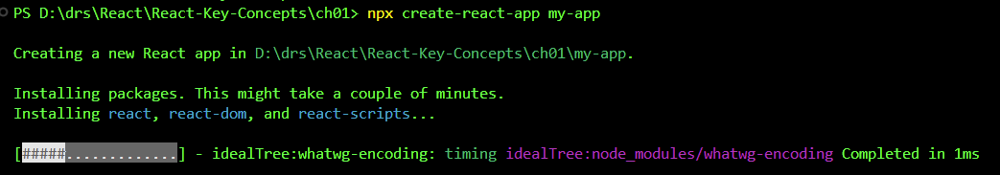

# React KeyConcepts

My self training in React Key Concepts book by Maximilian Schwarzmüller.

## Setting up your environment

    1. Install Node.js and npm (included with your installation by default).

s[Node.js](https://nodejs.org/en/)

    
## Installing React.js

    1.  Open up PowerShell window (or bash if Linux).
    2.  Make a directory.
    ```
    mkdir react-projects
    cd react-projects
    ```
    3.  npm init react-app my-app



    4.  cd my-app
    5.  Grant permission when prompted to install all required files and folders.
    6.  npm start
    7.  This should open a new browser to http://localhost:3000. 
        If not, open browser and enter http://localhost:3000 as web address.
    

